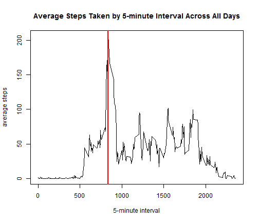
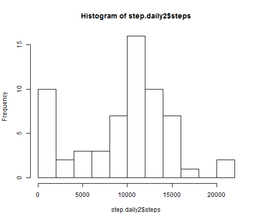
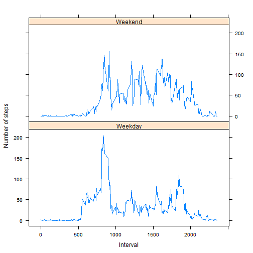

## Loading and preprocessing the data

```r
activity <- read.csv("C:/Users/cgu018/Desktop/Analytics/Open Course/DS JHU/Reproducible Research/project 1/activity.csv", sep = ",", header = TRUE)
```

## What is mean total number of steps taken per day?
a. Calculate the total number of steps taken per day, and the mean and median


```r
step.daily <- aggregate(. ~ date, data=activity, FUN=sum)
mean.steps = mean(step.daily$steps)
mean.steps
```

```
## [1] 10766.19
```

```r
median.steps = median(step.daily$steps)
median.steps
```

```
## [1] 10765
```


b.histogram of the total number of steps taken each day


```r
hist(step.daily$steps, breaks = 10, xlab="total steps per day")
```

 


## What is the average daily activity pattern?
a. Calculate the average number of steps taken by interval, averaged across all days. Also show the interval with the maximum steps


```r
step.interval <- aggregate(. ~ interval, data=activity, FUN=mean)

#the interval with max steps across day
max.steps = max(step.interval$steps)
max.interval = step.interval[which(step.interval$steps == max.steps),1] 
max.interval
```

```
## [1] 835
```

b. time series plot (i.e. type = "l") of the 5-minute interval (x-axis) and the average number of steps taken, averaged across all days (y-axis)

```r
plot(step.interval$interval, step.interval$steps, type="l", xlab="5-minute interval", ylab="average steps", main="Average Steps Taken by 5-minute Interval Across All Days")

# add the line for the interval with max averaged steps
abline(v=max.interval, col = "red", lwd=2) 
```

 

## Imputing missing values
a. Fill in the missing values using median of the same interval

```r
#Calculate the number of rows with missing step values
length(which(is.na(activity$steps)))
```

```
## [1] 2304
```

```r
#Create a copy of activity data frame
activity.copy = "activity.copy" #name of the new copy
assign(activity.copy, activity)

# Use the median for that 5-minute interval for the missing values
for (i in 1:length(activity.copy[,1])) {
    if(is.na(activity.copy[i,1])) 
        activity.copy[i,1] = median(activity.copy[activity.copy$interval == activity.copy[i,3],"steps"], na.rm=TRUE) 
 }

# check if any NA value left
length(which(is.na(activity.copy$steps)))
```

```
## [1] 0
```

b. For the new dataset, calculate the total number of steps taken per day, and the mean and median


```r
step.daily2 <- aggregate(. ~ date, data=activity.copy, FUN=sum)
mean.steps2 = mean(step.daily2$steps)
median.steps2 = median(step.daily2$steps)

#Calculate the difference of mean and median of total steps by day between two datasets
diff.mean = mean.steps2 - mean.steps
diff.median = median.steps2 - median.steps
```
The NA-filled-in dataset has lower mean and median of total steps by day, probably because the missing data exist more likely at the lower side. See left side of the following histogram.


```r
hist(step.daily2$steps, breaks = 10)
```

 

## Are there differences in activity patterns between weekdays and weekends?
a. Create a new factor variable in the activity.copy dataset with two levels weekdays and weekend

```r
activity.copy$weekend <- as.factor(ifelse(weekdays( as.Date(activity.copy$date)) %in% c("Saturday","Sunday"), "Weekend", "Weekday")) 
```

b. Calculate the average number of steps taken at 5-minute interval, averaged across all weekday days or weekend days

```r
step.interval.wend <- aggregate(. ~ interval+weekend, data=activity.copy, FUN=mean)

#the interval with average steps across weekdays and weekend
library(lattice)
xyplot(steps~interval|weekend, data = step.interval.wend, type="l", xlab="Interval", ylab="Number of steps", layout=c(1,2))
```

 
